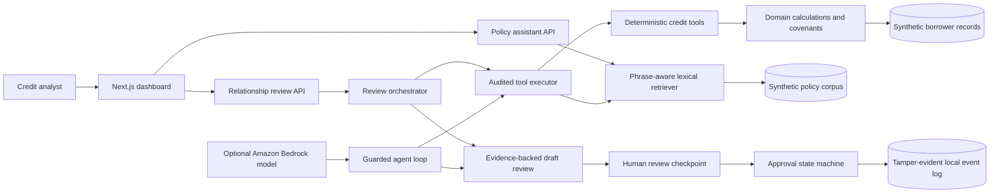

# CreditOps

[](https://github.com/wale2002/creditops-agent/actions/workflows/quality-gates.yml)

CreditOps is an evidence-first commercial credit review prototype. It combines deterministic financial calculations, policy retrieval with citations, permission-controlled agent tools, audit events, and explicit human approval boundaries in one portfolio project.

> **Demonstration only:** every borrower, financial record, covenant, policy, and recorded decision in this repository is synthetic. CreditOps does not make real lending decisions or approve real credit.


## Quick start and two-minute tour

Requires Node.js 22.14 or later and npm. From the repository root:

```bash
git clone https://github.com/wale2002/creditops-agent.git
cd creditops-agent
npm install
npm run build
npm run dev --workspace web
```

Open [http://localhost:3000](http://localhost:3000), then:

1. Select **Atlas Manufacturing**. Its DSCR is calculated from recorded figures and flagged against its covenant threshold.
2. Ask the policy assistant **“What is the minimum DSCR requirement?”** Inspect the cited policy evidence next to the answer. Ask **“What is the office dress code?”** to see a safe refusal.
3. Scroll to the **audit trail** and **human decision** sections. Local development enables a clearly marked demo credit-officer identity; a production build disables that identity by default.

No AWS account, API key, or paid model is needed for this walkthrough.

On Windows, if a globally installed npm exits before running a script, replace `npm` in the commands above with `node "C:\Program Files\nodejs\node_modules\npm\bin\npm-cli.js"` to use the npm bundled with Node.js.

## What runs where

| Capability | Current status |
| --- | --- |
| Dashboard, calculated ratios, covenant checks, policy Q&A, draft reviews | Run in the web app using synthetic data and local code. The policy assistant is extractive RAG and makes no model call. |
| Human approval | Runs with a demo credit-officer identity during local development. Disabled in production unless explicitly enabled; no workforce identity provider is connected. |
| MCP server | Working local stdio server with read-only tools. It is separate from the web app and requires an MCP-compatible host. |
| Amazon Bedrock | Optional model adapter and demo runner. Dry-run by default; the web app does not invoke Bedrock. |
| AWS infrastructure | CDK stack can be tested and synthesized locally. It has not been deployed by this project. |
| Quality gates | GitHub Actions runs tests, a small labelled RAG evaluation, builds, CDK synthesis, and linting. |

[View the simple flowchart](docs/images/creditops-linkedin-flowchart.png) for a one-page overview. The status table above distinguishes the connected web experience from optional integrations.

## What the project demonstrates

- **Deterministic credit analysis:** DSCR, leverage, liquidity, exposure, and covenant results are calculated in code rather than generated by a language model.
- **Grounded policy Q&A:** an offline RAG assistant retrieves policy sections, returns supporting citations, and safely refuses unrelated questions.
- **Agentic workflows:** a guarded tool loop can retrieve borrower data, run calculations, test covenants, check documents, and search policy evidence.
- **Security controls:** role-based permissions are enforced at the tool-execution boundary and every dispatched tool call produces an audit event.
- **Human-in-the-loop design:** the system may draft findings, while a separate state machine permits only an authorized credit-officer identity to approve or reject a review with a rationale.
- **Evaluation-driven development:** a labelled RAG benchmark is enforced locally and in GitHub Actions alongside tests, builds, and linting.
- **Optional cloud model integration:** an Amazon Bedrock adapter supports Nova Lite through a cost-safe runner that is dry-run by default.
- **Standardized tool integration:** a local Model Context Protocol server exposes five read-only banking tools with schemas, RBAC, and linked audit events.
- **Infrastructure as code:** an AWS CDK stack synthesizes a least-privilege serverless boundary locally, with no deployment or AWS request.

## Architecture



The local web experience sends no AWS requests. The Bedrock path is a separate, optional adapter for demonstrating model-directed tool use. Both paths rely on the same deterministic tools and policy evidence.

## RAG approach

The current implementation deliberately uses a transparent lexical retriever rather than hiding retrieval behind a managed knowledge base:

1. Markdown policy sections are ingested into independently citable chunks.
2. Queries and chunks are normalized into searchable terms and phrases.
3. Retrieval scores term overlap, phrase matches, and domain-specific signals.
4. The assistant extracts an answer from the best-supported chunk and returns its source, section, and quoted evidence.
5. If the evidence threshold is not met, it returns `insufficient_evidence` instead of inventing an answer.

This makes the first version inexpensive, deterministic, and easy to evaluate. A production evolution could replace the lexical ranking stage with embeddings and a vector database while preserving the citation, evaluation, permission, and audit contracts.

## RAG quality gate

Run the benchmark with:

```bash
npm run eval:policy
```

The current labelled set contains six answerable questions and two unrelated control questions. All thresholds must remain at 100%:

| Metric | Current result | What it checks |
| --- | ---: | --- |
| Status accuracy | 100% | Correctly answers or refuses each question |
| Retrieval hit rate | 100% | Expected policy section appears in retrieved evidence |
| Top-1 accuracy | 100% | Expected section is ranked first |
| Citation validity | 100% | Citation metadata and evidence match the corpus |
| Safe-refusal accuracy | 100% | Unrelated questions do not produce fabricated evidence |

The evaluation found a real ranking weakness: the liquidity question retrieved the correct section but did not initially rank it first. A phrase-aware scoring bonus fixed the behaviour, and the regression case now runs in CI. See [the evaluation notes](docs/rag-evaluation.md).

## Guardrails and auditability

CreditOps applies controls in code, not only in prompts:

- Runtime input validation rejects malformed tool arguments.
- Role permissions are checked before a tool executes.
- Required-tool rules prevent a model from skipping evidence collection.
- Tool calls record success, denial, or error events for traceability.
- Returned records are cloned so callers cannot mutate source fixtures.
- Only the `CREDIT_OFFICER` role can submit a final decision; banker, system, and AI roles are rejected in code.
- Final decisions require a rationale and cannot be overwritten for the same evidence digest.
- Optimistic version checks reject stale concurrent submissions.
- Decision events are hash-chained and revalidated when read so local tampering is detected.

Tool-execution audit events remain an in-memory demonstration. Human decisions are persisted locally as an append-only, hash-chained JSONL event log under the ignored `.creditops-data` directory. This is intentionally a single-process portfolio adapter; production would use authenticated identities and durable transactional storage with retention and access policies.

## Repository structure

```text
apps/web/                    Next.js dashboard and API routes
packages/domain/             Financial models, calculations, covenants, fixtures
packages/agent-tools/        RAG, tools, RBAC, audit, orchestration, agent loop
packages/mcp-server/         Read-only MCP tools and stdio transport
infra/                       AWS CDK stack, Lambda boundary, assertions
docs/policies/               Synthetic commercial credit policy corpus
docs/rag-evaluation.md       Evaluation methodology and metrics
docs/bedrock-local-demo.md   Optional Bedrock setup and cost-safety guide
docs/mcp-server.md           MCP tools, security model, and client configuration
docs/aws-infrastructure.md   CDK architecture, controls, and cost boundary
docs/human-approval.md       Approval state machine, API, and security boundary
.github/workflows/           Automated quality gates
```

## Verify the project

```bash
npm run test
npm run eval:policy
npm run build
npm run lint
```

Or run the same combined gate used by CI:

```bash
npm run ci
```

The automated tests cover domain calculations, covenant handling, policy retrieval, safe refusals, evaluation metrics, credit tools, permissions, human approvals, audit integrity, orchestration, the agent loop, the Bedrock adapter, the MCP boundary, and synthesized infrastructure controls.

## Human approval workflow

The dashboard includes an explicit credit-officer checkpoint. A reviewer must provide a rationale before approving or rejecting a review. The server—not the browser—supplies the local demo identity, and the workflow independently enforces the `CREDIT_OFFICER` role.

Each decision is tied to a SHA-256 digest of the evidence-backed draft, protected by an expected-version check, and appended to a hash-chained local event log. Once a review digest has a final decision, it cannot be overwritten. See the [human approval guide](docs/human-approval.md).

The built-in identity is clearly marked `LOCAL_DEMO`. It is enabled by default only during local development. Production mode rejects demo approvals unless `CREDITOPS_ALLOW_DEMO_APPROVALS=true` is deliberately set; a real deployment should replace the adapter with authenticated workforce identity.

## Local MCP server

CreditOps includes a stdio MCP server so compatible clients can discover and call controlled banking tools without receiving direct access to application internals. It exposes only read-oriented operations; there is no approve, update, delete, or covenant-waiver tool.

```bash
npm run build --workspace @creditops/mcp-server
npm run start --workspace @creditops/mcp-server
```

The server runs locally, reads synthetic data, and makes no AWS request. See the [MCP server guide](docs/mcp-server.md) for its tools, client configuration, identity boundary, and audit behaviour.

## AWS infrastructure without deployment

The CDK package defines a private S3 policy bucket, bounded Node.js Lambda, throttled HTTP API, retained CloudWatch logs, alarms, and an operations dashboard. Bedrock invocation permission is absent by default.

```bash
npm run test --workspace @creditops/infra
npm run synth:infra
```

Synthesis creates a local CloudFormation template under `cdk.out` and does not create AWS resources. CreditOps intentionally provides no deployment script. See the [AWS infrastructure guide](docs/aws-infrastructure.md).

## Optional Amazon Bedrock demo

The Bedrock runner performs a local configuration preflight by default and sends **no AWS request** unless `--live` is explicitly supplied.

```bash
cp .env.example .env
npm run demo:bedrock --workspace @creditops/agent-tools
```

An intentional live request is documented separately in [the Bedrock demo guide](docs/bedrock-local-demo.md). Live AWS usage may consume promotional credits or incur charges depending on the account, Region, model, and plan.

Never commit AWS keys. Use temporary credentials or an AWS profile through the SDK credential provider chain.

## Interview walkthrough

A concise way to explain the project:

> I separated probabilistic AI from deterministic credit logic. The model can select approved tools and draft an evidence-backed review, but calculations, covenant tests, permissions, citations, and final decisions are enforced in code. A credit-officer-only state machine records rationale, rejects stale writes, prevents overwrites, and creates a tamper-evident event chain. A labelled retrieval benchmark and CI gate ensure grounding quality is measured rather than assumed.

This design is intentionally aligned with regulated financial software: explainable calculations, controlled data access, traceable actions, evidence-backed outputs, and human accountability.

## Roadmap

- Replace synthetic fixtures with a repository interface backed by a database.
- Add embedding-based hybrid retrieval and compare it against the lexical baseline.
- Move tool audit events and the local decision log to transactional durable storage.
- Add identity-provider integration and fine-grained borrower entitlements.
- Add model and retrieval observability, latency, and cost dashboards.
- Expand the evaluation set with adversarial, ambiguous, and multi-policy questions.

## Author

Built by **Oluwaferanmi Adewusi** as a hands-on AI engineering portfolio project.

