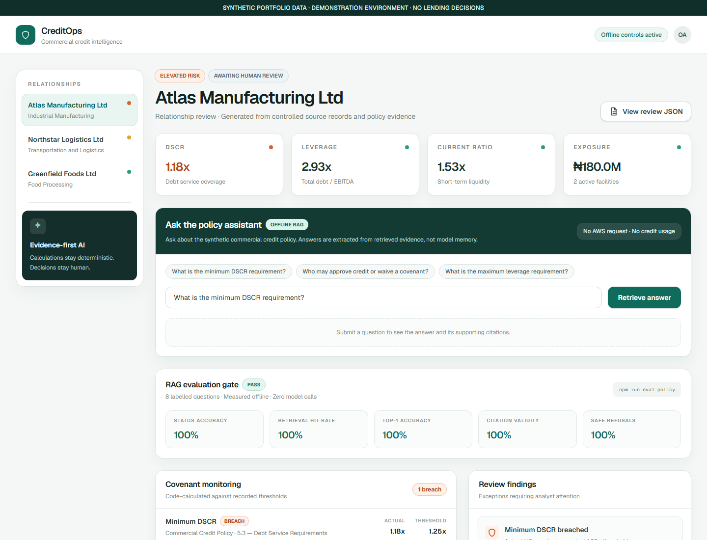
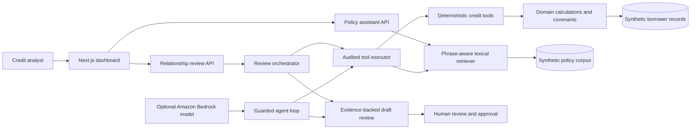

# CreditOps

[](https://github.com/wale2002/creditops-agent/actions/workflows/quality-gates.yml)

CreditOps is an evidence-first commercial credit review prototype. It combines deterministic financial calculations, policy retrieval with citations, permission-controlled agent tools, audit events, and explicit human approval boundaries in one portfolio project.

> **Demonstration only:** every borrower, financial record, covenant, and policy in this repository is synthetic. CreditOps does not make lending decisions or approve credit.



## What the project demonstrates

- **Deterministic credit analysis:** DSCR, leverage, liquidity, exposure, and covenant results are calculated in code rather than generated by a language model.
- **Grounded policy Q&A:** an offline RAG assistant retrieves policy sections, returns supporting citations, and safely refuses unrelated questions.
- **Agentic workflows:** a guarded tool loop can retrieve borrower data, run calculations, test covenants, check documents, and search policy evidence.
- **Security controls:** role-based permissions are enforced at the tool-execution boundary and every attempted tool call produces an audit event.
- **Human-in-the-loop design:** the system may draft findings, but no tool exists for an AI model to approve credit, waive a covenant, or make a final lending decision.
- **Evaluation-driven development:** a labelled RAG benchmark is enforced locally and in GitHub Actions alongside tests, builds, and linting.
- **Optional cloud model integration:** an Amazon Bedrock adapter supports Nova Lite through a cost-safe runner that is dry-run by default.
- **Standardized tool integration:** a local Model Context Protocol server exposes five read-only banking tools with schemas, RBAC, and linked audit events.

## Architecture



The local web experience is fully offline after installation and sends no AWS requests. The Bedrock path is a separate, optional adapter for demonstrating model-directed tool use. Both paths rely on the same deterministic tools and policy evidence.

## RAG approach

The current implementation deliberately uses a transparent lexical retriever rather than hiding retrieval behind a managed knowledge base:

1. Markdown policy sections are ingested into independently citable chunks.
2. Queries and chunks are normalized into searchable terms and phrases.
3. Retrieval scores term overlap, phrase matches, and domain-specific signals.
4. The assistant extracts an answer from the best-supported chunk and returns its source, section, and quoted evidence.
5. If the evidence threshold is not met, it returns `insufficient_evidence` instead of inventing an answer.

This makes the first version inexpensive, deterministic, and easy to evaluate. A production evolution could replace the lexical ranking stage with embeddings and a vector database while preserving the citation, evaluation, permission, and audit contracts.

## RAG quality gate

Run the benchmark with:

```bash
npm run eval:policy
```

The current labelled set contains six answerable questions and two unrelated control questions. All thresholds must remain at 100%:

| Metric | Current result | What it checks |
| --- | ---: | --- |
| Status accuracy | 100% | Correctly answers or refuses each question |
| Retrieval hit rate | 100% | Expected policy section appears in retrieved evidence |
| Top-1 accuracy | 100% | Expected section is ranked first |
| Citation validity | 100% | Citation metadata and evidence match the corpus |
| Safe-refusal accuracy | 100% | Unrelated questions do not produce fabricated evidence |

The evaluation found a real ranking weakness: the liquidity question retrieved the correct section but did not initially rank it first. A phrase-aware scoring bonus fixed the behaviour, and the regression case now runs in CI. See [the evaluation notes](docs/rag-evaluation.md).

## Guardrails and auditability

CreditOps applies controls in code, not only in prompts:

- Runtime input validation rejects malformed tool arguments.
- Role permissions are checked before a tool executes.
- Required-tool rules prevent a model from skipping evidence collection.
- Tool calls record success, denial, or error events for traceability.
- Returned records are cloned so callers cannot mutate source fixtures.
- The final output is labelled as a draft awaiting human review.

The current audit store is an append-only in-memory demonstration. A production design would persist signed events to durable storage with retention, identity, and access policies.

## Repository structure

```text
apps/web/                    Next.js dashboard and API routes
packages/domain/             Financial models, calculations, covenants, fixtures
packages/agent-tools/        RAG, tools, RBAC, audit, orchestration, agent loop
packages/mcp-server/         Read-only MCP tools and stdio transport
docs/policies/               Synthetic commercial credit policy corpus
docs/rag-evaluation.md       Evaluation methodology and metrics
docs/bedrock-local-demo.md   Optional Bedrock setup and cost-safety guide
docs/mcp-server.md           MCP tools, security model, and client configuration
.github/workflows/           Automated quality gates
```

## Run locally

### Prerequisites

- Node.js 22.14 or later
- npm

### Install and start

```bash
git clone https://github.com/wale2002/creditops-agent.git
cd creditops-agent
npm install
npm run build
npm run dev --workspace web
```

Open [http://localhost:3000](http://localhost:3000).

## Verify the project

```bash
npm run test
npm run eval:policy
npm run build
npm run lint
```

Or run the same combined gate used by CI:

```bash
npm run ci
```

The current suite contains 46 automated tests across domain calculations, covenant handling, policy retrieval, safe refusals, evaluation metrics, credit tools, permissions, audit events, orchestration, the agent loop, the Bedrock adapter, and the MCP boundary.

## Local MCP server

CreditOps includes a stdio MCP server so compatible clients can discover and call controlled banking tools without receiving direct access to application internals. It exposes only read-oriented operations; there is no approve, update, delete, or covenant-waiver tool.

```bash
npm run build --workspace @creditops/mcp-server
npm run start --workspace @creditops/mcp-server
```

The server runs locally, reads synthetic data, and makes no AWS request. See the [MCP server guide](docs/mcp-server.md) for its tools, client configuration, identity boundary, and audit behaviour.

## Optional Amazon Bedrock demo

The Bedrock runner performs a local configuration preflight by default and sends **no AWS request** unless `--live` is explicitly supplied.

```bash
cp .env.example .env
npm run demo:bedrock --workspace @creditops/agent-tools
```

An intentional live request is documented separately in [the Bedrock demo guide](docs/bedrock-local-demo.md). Live AWS usage may consume promotional credits or incur charges depending on the account, Region, model, and plan.

Never commit AWS keys. Use temporary credentials or an AWS profile through the SDK credential provider chain.

## Interview walkthrough

A concise way to explain the project:

> I separated probabilistic AI from deterministic credit logic. The model can decide which approved tools to call and draft an evidence-backed review, but financial ratios, covenant tests, permissions, citations, and approval boundaries are enforced in code. I then added a labelled retrieval benchmark and CI quality gate so grounding quality is measured rather than assumed.

This design is intentionally aligned with regulated financial software: explainable calculations, controlled data access, traceable actions, evidence-backed outputs, and human accountability.

## Roadmap

- Replace synthetic fixtures with a repository interface backed by a database.
- Add embedding-based hybrid retrieval and compare it against the lexical baseline.
- Persist audit events in tamper-evident durable storage.
- Add identity-provider integration and fine-grained borrower entitlements.
- Add model and retrieval observability, latency, and cost dashboards.
- Expand the evaluation set with adversarial, ambiguous, and multi-policy questions.

## Author

Built by **Oluwaferanmi Adewusi** as a hands-on AI engineering portfolio project.

