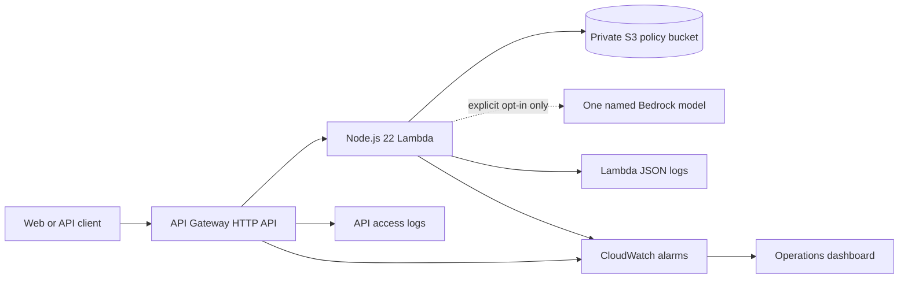

# CreditOps AWS infrastructure

CreditOps includes an AWS CDK v2 stack that can be built, tested, and synthesized entirely on the local machine. The current milestone does not deploy resources, contact AWS, or consume AWS credits.

## Architecture



## Defined resources

- One API Gateway HTTP API with a default auto-deploying stage.
- One ARM64 Node.js 22 Lambda function containing a `/health` endpoint and a safe `501` placeholder for application routes.
- One S3 bucket for synthetic policy documents.
- Two CloudWatch log groups, each retained for 30 days and retained if the stack is removed.
- Two CloudWatch alarms covering Lambda errors and API 5xx responses.
- One CloudWatch operations dashboard.
- One least-privilege Lambda execution role.

The stack does not currently create a database, VPC, NAT Gateway, secret, OpenSearch collection, or Bedrock knowledge base. Those services would expand both architecture and cost and require a separate review.

## Security and cost controls

### S3

- Blocks every form of public access.
- Requires TLS through an explicit deny policy.
- Uses server-side encryption.
- Enables versioning.
- Retains the bucket instead of destroying documents with the stack.
- Grants the Lambda read access only under `policies/*`.

### Lambda

- Runs on the supported `nodejs22.x` managed runtime.
- Uses ARM64, 256 MB memory, and a 15-second timeout.
- Reserves only two concurrent executions to limit accidental fan-out.
- Writes structured JSON logs.
- Uses X-Ray active tracing.

### API Gateway

- Limits the stage to a steady rate of two requests per second and a burst of five.
- Writes access logs without caller or user identity fields.
- Publishes detailed CloudWatch metrics.

### Bedrock

No `bedrock:InvokeModel` permission exists in the default stack. The stack code can add permission only when `enableBedrock` is explicitly true and a model ID is supplied. The generated policy targets one foundation-model ARN rather than `*`.

## Local verification

From the repository root:

```powershell
npm run build --workspace @creditops/infra
npm run test --workspace @creditops/infra
npm run synth:infra
```

The final command writes the local template to:

```text
infra/cdk.out/CreditOpsDevelopment.template.json
```

Depending on how npm sets the workspace process directory, the ignored `cdk.out` directory may appear at the workspace root. In either location it is generated output and must not be committed.

The infrastructure tests inspect the synthesized CloudFormation template. They verify encryption, public-access blocking, retained logs, API throttling, resource counts, read-only S3 access, and the absence of Bedrock permission by default.

## Deployment boundary

This repository intentionally has no `deploy` script. Do not run `cdk deploy` until all of the following have been completed:

1. Review every synthesized resource and IAM statement.
2. Estimate Region-specific costs with the AWS Pricing Calculator.
3. Add an AWS Budget and alerts for the target account.
4. Select a non-root deployment identity with least privilege.
5. Decide removal and data-retention requirements.
6. Obtain explicit approval to create cloud resources.

Synthesis proves the infrastructure design and produces deployable CloudFormation without creating anything in the AWS account.
