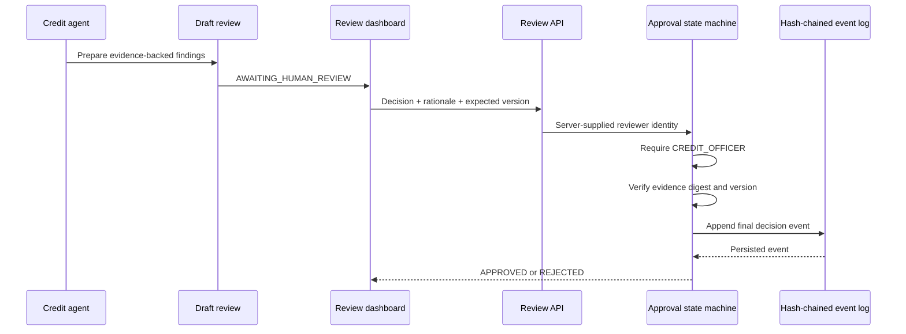

# Human approval workflow

CreditOps separates AI-generated analysis from final human accountability. The agent can retrieve evidence, calculate ratios, test covenants, and prepare a draft. It cannot call the approval service or create a final lending decision.

## Flow



## Enforced invariants

- Only the `CREDIT_OFFICER` role can make a final decision.
- `AI_AGENT`, `BANKER`, and `SYSTEM_MONITOR` roles are rejected by the approval service.
- A rationale between 10 and 1,000 characters is required.
- The decision is bound to a SHA-256 digest of the complete draft review.
- An expected-version check rejects stale or concurrent submissions.
- A final decision for the same review digest cannot be replaced.
- A materially changed draft has a different digest and returns to `AWAITING_HUMAN_REVIEW`.
- Every event contains the previous event hash, creating a tamper-evident global chain.
- The chain, event hashes, and per-borrower version sequence are verified on every read.

## Local persistence

The local adapter writes newline-delimited JSON to:

```text
.creditops-data/review-decisions.jsonl
```

The directory is ignored by Git. Restarting the local application preserves decisions. The adapter is intentionally synchronous and single-process so its behavior is easy to inspect during an interview. Production should replace it with a transactional database or append-only ledger that provides atomic conditional writes, backups, retention, encryption, and access controls.

For isolated automated or smoke testing, `CREDITOPS_DECISION_LOG_PATH` can point to a different repository-relative JSONL file.

Do not edit the JSONL file. Any change to a recorded field causes the integrity verification to fail closed.

The local hash chain provides integrity checking, not cryptographic authorship. A person with write access to the file and code could recompute the entire chain. A production design should sign events with a protected key or use a managed immutable ledger in addition to filesystem and identity controls.

## Identity boundary

The browser never submits an actor ID or role. The server supplies a local demonstration identity:

```text
actorId: local-demo-credit-officer
role: CREDIT_OFFICER
source: LOCAL_DEMO
```

`CREDITOPS_DEMO_REVIEWER_ID` can change the displayed local actor ID. The adapter is enabled automatically in development. In production mode it is disabled unless `CREDITOPS_ALLOW_DEMO_APPROVALS=true` is explicitly configured.

This is not a substitute for authentication. A deployed version should derive the actor and role from a validated workforce session or identity-provider token and should never accept identity claims from request JSON.

## API

Read a review and its current decision state:

```http
GET /api/reviews/{borrowerId}
```

Submit a human decision:

```http
POST /api/reviews/{borrowerId}
Content-Type: application/json

{
  "decision": "APPROVED",
  "rationale": "Approved subject to monthly covenant monitoring.",
  "expectedVersion": 0
}
```

The API returns `409 Conflict` for a stale version or an existing final decision, `403 Forbidden` for an unauthorized role, `400 Bad Request` for invalid input, and `500 Internal Server Error` when the log integrity check fails.

## Verification

Run the workflow tests:

```powershell
npm run test --workspace @creditops/agent-tools
```

The tests prove the awaiting state, authorized approval, AI denial, optimistic concurrency, overwrite prevention, changed-review behavior, restart persistence, and tamper detection.
